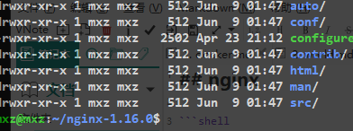

title: nginx 
date: 2019-06-10 19:41:58
tags:
categories: 运维

##### nginx 安装

```bash
  wget http://nginx.org/download/nginx-1.16.0.tar.gz
  tar -xvf nginx-1.16.0.tar.gz
  whereis vim  #找出vim位置
  sudo cp -r contrib/vim/* /etc/vim   # vim高亮配置
```
查看nginx文件


安装
```bash
sudo apt-get  install  build-essential   # 安装gcc编译工具
sudo apt-get install libpcre3 libpcre3-dev
sudo apt-get install openssl libssl-dev
sudo apt-get install zlib1g-dev
./configure --prefix=/home/mxz/nginx
make
suido make install 
```

##### nginx命令行
```conf
nginx -s stop ：快速关闭Nginx，可能不保存相关信息，并迅速终止web服务。
nginx -s quit ：平稳关闭Nginx，保存相关信息，有安排的结束web服务。
nginx -s reload ：因改变了Nginx相关配置，需要重新加载配置而重载。
nginx -s reopen ：重新打开日志文件。
nginx -c filename ：为 Nginx 指定一个配置文件，来代替缺省的。
nginx -t ：不运行，而仅仅测试配置文件。nginx 将检查配置文件的语法的正确性，并尝试打开配置文件中所引用到的文件。
nginx -v：显示 nginx 的版本。
nginx -V：显示 nginx 的版本，编译器版本和配置参数。
```


::: alert-danger
执行 nginx -s reload 可能会报
[error] invalid PID number "" in "/home/mxz/nginx/logs/nginx.pid"

 sudo ./nginx -c ~/nginx/conf/nginx.conf  解决
:::

```
ps -ef | grep nginx  查看运行
```

##### nginx 升级
当升级nginx 时 只需将编译后的 sbin 文件copy过来
kill -USR2 nginx进程号  平滑的过度  
并且老的master 进程不会关掉,方便我们回退

###### 日志切割
备份 access.log
nginx -s reopen 会重新生成日志
可以制作定时任务 按天日志分割
```
crontab -l
```
```bash
#!/bin/bash
LOGS_PATH=/home/mxz/nginx/logs/history
CUR_LOGS_PATH=/home/mxz/nginx/logs
YESTERDAY=${date -d "yesterday" +%Y-%m-%d}
mv ${CUR_LOGS_PATH}/access.log ${LOGS_PATH}/access_${YESTERDAY}.log
#向Nginx 主进程发送URSR1信号. USR1 信号是重新打开日志文件
kill -USR1 $(cat /home/mxz/nginx/logs/nginx.pid)
```

##### nginx.conf
nginx压缩配置   对cpu损耗  传输效率提高


代理服务
启动 nginx服务1  设定
```conf
	server {
		listen 127.0.0.1:8080;
		server_name mxz.com;

		access_log logs/mxz.access.log main;

		location / {
		    alias dlib/;
		    autoindex on; #访问/url 显示目录文件
		    set $limit_rate 1k; #限制某些大文件的访问速度
		}
	}
```
反向代理服务器
```conf
   # cache 设置
    proxy_cache_path /tmp/nginxcache levels=1:2 keys_zone=my_cache:10m max_size=10g
                inactive=60m use_temp_path=off;

    upstream local {
        server 127.0.0.1:8080;
    }
    
	server {
		listen 80;
		server_name mxz.com;

		access_log logs/mxz.access.log main;

		location / {
            proxy_set_header Host $host;
            proxy_set_header X-Real-IP $remote_addr;
            proxy_set_header X-Forwarded-For $proxy_add_x_forwarded_for;

            proxy_cache_key $host$uri$is_args$args;
            proxy_cache_valid 200 304 302 1d;
            proxy_pass http://local;
		}
	}
```

##### 分析Access.log
1.安装 sudo apt install goaccess
```
goaccess mxz.access.log -o ../html/report.html --real-time-html --time-format='%H:%M:%S' --date-format='%d/%b/%Y' --log-format=COMBINED

```

##### 使用免费SSL证书实现一个HTTPS站点
```
sudo apt-get install python-certbot-nginx

sudo certbot --nginx --nginx-server-root=/home/mxz/nginx/conf/ -d mxz.com
```

##### 使用openResty
```
wget https://openresty.org/download/openresty-1.15.8.1.tar.gz
./configure --prefix=/home/mxz/openresty
make
suido make install      #编译安装
```
配置nginx.conf 使用lua脚本


```conf
#运行用户
#user somebody;

#启动进程,通常设置成和cpu的数量相等
worker_processes  1;

#全局错误日志
error_log  D:/Tools/nginx-1.10.1/logs/error.log;
error_log  D:/Tools/nginx-1.10.1/logs/notice.log  notice;
error_log  D:/Tools/nginx-1.10.1/logs/info.log  info;

#PID文件，记录当前启动的nginx的进程ID
pid        D:/Tools/nginx-1.10.1/logs/nginx.pid;

#工作模式及连接数上限
events {
   worker_connections 1024;    #单个后台worker process进程的最大并发链接数
}

#设定http服务器，利用它的反向代理功能提供负载均衡支持
http {
   #设定mime类型(邮件支持类型),类型由mime.types文件定义
   include       D:/Tools/nginx-1.10.1/conf/mime.types;
   default_type  application/octet-stream;
   
   #设定日志
   log_format  main  '[$remote_addr] - [$remote_user] [$time_local] "$request" '
                     '$status $body_bytes_sent "$http_referer" '
                     '"$http_user_agent" "$http_x_forwarded_for"';
                     
   access_log    D:/Tools/nginx-1.10.1/logs/access.log main;
   rewrite_log     on;
   
   #sendfile 指令指定 nginx 是否调用 sendfile 函数（zero copy 方式）来输出文件，对于普通应用，
   #必须设为 on,如果用来进行下载等应用磁盘IO重负载应用，可设置为 off，以平衡磁盘与网络I/O处理速度，降低系统的uptime.
   sendfile        on;
   #tcp_nopush     on;

   #连接超时时间
   keepalive_timeout  120;
   tcp_nodelay        on;
   
   #gzip压缩开关
   #gzip  on;

   #设定实际的服务器列表 
   upstream zp_server1{
       server 127.0.0.1:8089;
   }

   #HTTP服务器
   server {
       #监听80端口，80端口是知名端口号，用于HTTP协议
       listen       80;
       
       #定义使用www.xx.com访问
       server_name  www.javastack.cn;
       
       #首页
       index index.html
       
       #指向webapp的目录
       root D:_WorkspaceProjectgithubzpSpringNotesspring-securityspring-shirosrcmainwebapp;
       
       #编码格式
       charset utf-8;
       
       #代理配置参数
       proxy_connect_timeout 180;
       proxy_send_timeout 180;
       proxy_read_timeout 180;
       proxy_set_header Host $host;
       proxy_set_header X-Forwarder-For $remote_addr;

       #反向代理的路径（和upstream绑定），location 后面设置映射的路径
       location / {
           proxy_pass http://zp_server1;
       } 

       #静态文件，nginx自己处理
       location ~ ^/(images|javascript|js|css|flash|media|static)/ {
           root D:_WorkspaceProjectgithubzpSpringNotesspring-securityspring-shirosrcmainwebappiews;
           #过期30天，静态文件不怎么更新，过期可以设大一点，如果频繁更新，则可以设置得小一点。
           expires 30d;
       }
   
       #设定查看Nginx状态的地址
       location /NginxStatus {
           stub_status           on;
           access_log            on;
           auth_basic            "NginxStatus";
           auth_basic_user_file  conf/htpasswd;
       }
   
       #禁止访问 .htxxx 文件
       location ~ /.ht {
           deny all;
       }
       
       #错误处理页面（可选择性配置）
       #error_page   404              /404.html;
       #error_page   500 502 503 504  /50x.html;
       #location = /50x.html {
       #    root   html;
       #}
   }
}

```
##### 负载均衡配置
```conf
   #设定负载均衡的服务器列表
   upstream load_balance_server {
       #weigth参数表示权值，权值越高被分配到的几率越大
       server 192.168.1.11:80   weight=5;
       server 192.168.1.12:80   weight=1;
       server 192.168.1.13:80   weight=6;
   }
```

##### 网站有多个webapp的配置
```conf
http {
   #此处省略一些基本配置
   
   upstream product_server{
       server www.mxz.com:8081;
   }
   
   upstream admin_server{
       server www.mxz.com:8082;
   }
   
   upstream finance_server{
       server www.mxz.com:8083;
   }

   server {
       #此处省略一些基本配置
       #默认指向product的server
       location / {
           proxy_pass http://product_server;
       }

       location /product/{
           proxy_pass http://product_server;
       }

       location /admin/ {
           proxy_pass http://admin_server;
       }
       
       location /finance/ {
           proxy_pass http://finance_server;
       }
   }
}
```

##### nginx 请求处理流程

##### Nginx进程结构


reload流程


##### 热升级流程


##### Nginx事件循环


##### epoll的原理


